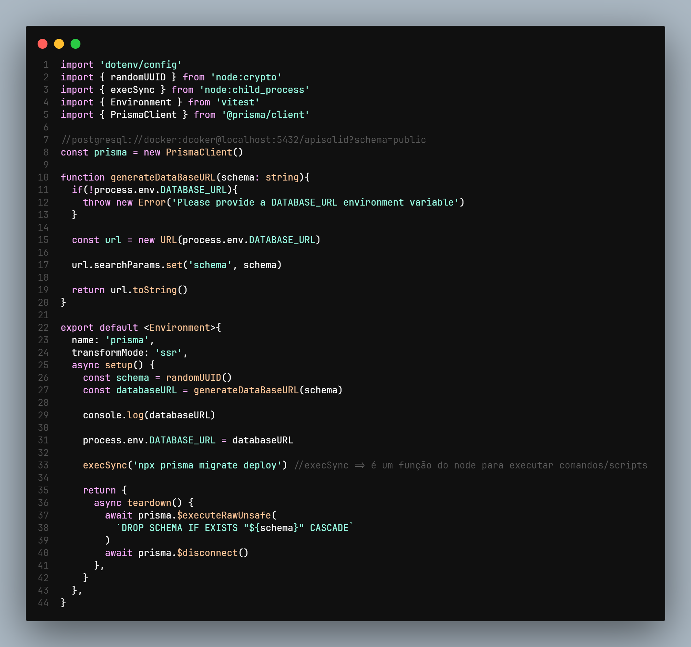

# Projeto de Autenticação e Registro de Usuários

## Cenário Geral

Este projeto visa implementar e testar as funcionalidades de autenticação e registro de usuários, utilizando uma arquitetura baseada em NestJS, Prisma e PostgreSQL. As funcionalidades principais são autenticar usuários e registrar novos usuários, garantindo a segurança e a integridade dos dados através de técnicas como hashing de senhas e validação de credenciais.

## Estratégias de Teste

Para garantir a eficácia e segurança das funcionalidades implementadas, foram utilizados testes unitários e de ponta a ponta (end-to-end). Os testes cobrem diversos cenários, desde a criação de usuários até a autenticação correta e tratamento de erros.

### I - Teste Funcional

**Funcionalidade: Autenticar Usuário**

A técnica de teste funcional foi aplicada com o objetivo de verificar as funcionalidades descritas e as validações. Foram realizados testes para garantir que a autenticação seja realizada corretamente com credenciais válidas e que erros apropriados sejam retornados para credenciais inválidas.

### II - Teste Funcional

**Funcionalidade: Registrar Usuário**

A técnica de teste funcional foi aplicada para verificar as funcionalidades de registro de novos usuários, incluindo a validação de dados e o tratamento de erros. Foram realizados testes para garantir que usuários com emails duplicados não possam ser registrados e que as senhas sejam corretamente hashadas antes de serem armazenadas.

Esse código garante que cada teste seja executado em um ambiente de banco de dados isolado, o que é essencial para manter a integridade dos testes e evitar interferências entre eles.

## Tecnologias Utilizadas

- **Express**: Framework de backend Node.js eficiente e escalável.
- **Prisma**: ORM para Node.js e TypeScript, simplificando o acesso ao banco de dados.
- **PostgreSQL**: Sistema de gerenciamento de banco de dados relacional avançado.

